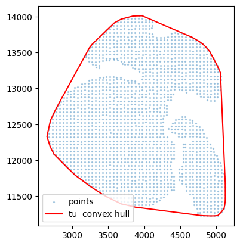
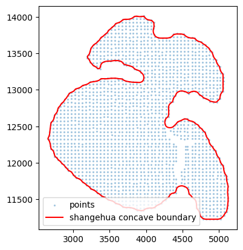
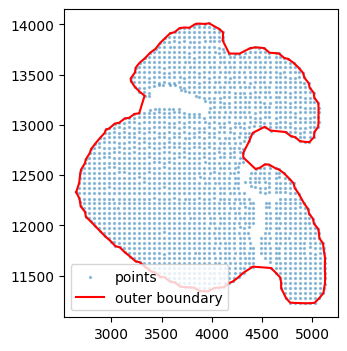
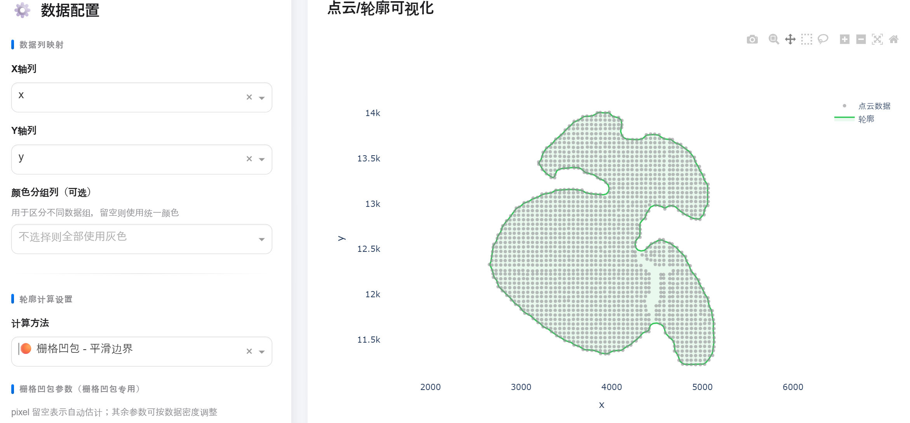

# PointsConcaveHull
凹包计算工具，用于精准提取空间转录组和空间代谢组的交集部分。

----
# 计算组织形状的方法 
- `凸包`：稳定、快，但会把凹陷“抹平”，不够贴合。(测试可以)
- `α-shape（凹包`：能贴合凹陷，是“尽可能贴合数据”的主力。（直接掉包不好用，建议自己写实现方法）
- `栅格化+等值线`：如果点云很密且你想要“视觉上的外轮廓”（尤其有孔洞、裂缝），它非常好用。（测试可以且速度快）
- `KNN凹包`：另一种“可控贴合”的凹包实现方式，适合你想更几何地控制边界。（不咋好用,速度慢） 

----

# 1. 凸包：作为baseline  
- 适用：你只需要一个外框，允许不贴合凹陷。
- 优点：简单、快、稳定
- 缺点：凹进去的地方全被“拉直” 

**代码**  
```
import numpy as np
from scipy.spatial import ConvexHull

points = df[['x', 'y']].values
pts = points 

def convex_boundary(pts):
    """
    输入:
      pts: (N, 2) ndarray

    输出:
      boundary_pts: (M, 2)，按顺序围一圈（闭合）
      boundary_idx: (M,)，对应原始 pts 的索引
    """
    pts = np.asarray(pts, float)
    hull = ConvexHull(pts)
    idx = hull.vertices           # 已经按顺/逆时针排序
    boundary = pts[idx]
    # 闭合一下
    boundary = np.vstack([boundary, boundary[0]])
    return boundary, idx 


boundary, idx = convex_boundary(pts)

plt.figure(figsize=(4,2.5))
plt.scatter(pts[:,0], pts[:,1], s=2, alpha=0.3, label="points")
plt.plot(boundary[:,0], boundary[:,1], "r-", lw=1.5, label="tu  convex hull")
plt.gca().set_aspect("equal", adjustable="box")
plt.legend()
plt.show()

```

**结果**  
 

-----  
# 2. 栅格化凹包 

**思路：栅格化 + 形态学 + 等值线 = 凹一点的外轮廓**

步骤很简单：

- 把所有点落到一个二维网格上（occupancy map）
- 对这个二值图做一点 closing / 高斯平滑，填掉小空洞、让轮廓顺一点
- 用 skimage.measure.find_contours 找等值线
- 取最长那条等值线，当成“最外层轮廓”
- （可选）用 KDTree 把这条轮廓上的点映射回原始散点，得到“外圈散点子集”

这样出来的轮廓会比凸包凹进去很多，在你那块“船形”数据上，会比较贴着下方的缺口和上边缘走。
此外，栅格化方法自带删除离群点操作。

**代码** 
```
from scipy.ndimage import gaussian_filter
from skimage.morphology import binary_closing, disk
from skimage.measure import find_contours

def concave_boundary_raster(pts,
                            pixel=None,      # 像素大小；None 时自动估计
                            pad=10,          # 边缘留白（像素）
                            close_r=3,       # 形态学闭运算半径
                            sigma=1.5,       # 高斯平滑 sigma
                            level=0.5):      # 等值线阈值
    """
    输入:
      pts   : (N, 2) 的散点坐标
    输出:
      boundary: (M, 2) 的轮廓坐标（按顺序围一圈）
    """
    pts = np.asarray(pts, float)
    x, y = pts[:, 0], pts[:, 1]

    xmin, xmax = x.min(), x.max()
    ymin, ymax = y.min(), y.max()

    # 自动估计像素大小: 把长边大约分成 400 像素
    if pixel is None:
        span = max(xmax - xmin, ymax - ymin)
        pixel = span / 400.0   # 400 可以自己调，大一点更平滑，小一点更贴

    # 网格尺寸
    W = int(np.ceil((xmax - xmin) / pixel)) + 1 + 2 * pad
    H = int(np.ceil((ymax - ymin) / pixel)) + 1 + 2 * pad

    # 1) 落点成二值图
    mask = np.zeros((H, W), dtype=bool)
    ix = np.round((x - xmin) / pixel).astype(int) + pad
    iy = np.round((y - ymin) / pixel).astype(int) + pad
    mask[iy, ix] = True

    # 2) 形态学闭运算填小空洞
    if close_r > 0:
        mask = binary_closing(mask, disk(close_r))

    # 3) 高斯平滑
    img = mask.astype(float)
    if sigma and sigma > 0:
        img = gaussian_filter(img, sigma=sigma)

    # 4) 找等值线
    contours = find_contours(img, level=level)
    if not contours:
        return None

    # 取最长的一条作为外轮廓
    max_c = max(contours, key=len)   # shape (M,2)，c[:,0]=row(y)，c[:,1]=col(x)
    
    # 所有轮廓, 映射回原始坐标系 
    all_boundaries = []
    for c in contours:
        boundary_i = np.column_stack([
            (c[:, 1] - pad) * pixel + xmin,
            (c[:, 0] - pad) * pixel + ymin,
        ])
        all_boundaries.append(boundary_i)  

    # 映射回原始坐标系
    boundary = np.column_stack([
        (max_c[:, 1] - pad) * pixel + xmin,
        (max_c[:, 0] - pad) * pixel + ymin,
    ])
    return boundary, all_boundaries 


boundary, all_boundaries = concave_boundary_raster(pts, pixel=None, close_r=10, sigma=2.0)

# 可视化最大组织区域结果
plt.scatter(pts[:,0], pts[:,1], s=2, alpha=0.3, label='points')
if boundary is not None:
    plt.plot(boundary[:,0], boundary[:,1], 'r-', lw=1.5, label='shangehua concave boundary')
plt.legend()
plt.gca().set_aspect('equal', adjustable='box')
plt.show()

```

**结果**  


---- 

# 3. 凹包 
`Delaunay 三角剖分 → 按外接圆半径过滤三角形 → 把保留的三角形 union 成一个区域`

`alpha` 数值严重影响结果 

**代码** 
```
from scipy.spatial import Delaunay, ConvexHull
from shapely.ops import polygonize, unary_union
from shapely.geometry import MultiPoint, Polygon, MultiPolygon, GeometryCollection, LineString

def alpha_shape(points, alpha):
    """
    计算凹包（alpha shape）
    使用 Delaunay 三角剖分 + 外接圆半径过滤
    返回 Shapely 几何对象（Polygon / MultiPolygon / GeometryCollection）
    """
    points = np.asarray(points, float)
    if len(points) < 4:
        return MultiPoint(points).convex_hull

    def circumradius(triangle_points):
        a, b, c = triangle_points
        a_len = np.linalg.norm(c - b)
        b_len = np.linalg.norm(c - a)
        c_len = np.linalg.norm(b - a)
        s = (a_len + b_len + c_len) / 2.0
        area = np.sqrt(max(s * (s - a_len) * (s - b_len) * (s - c_len), 0.0))
        if area < 1e-10:
            return float("inf")
        return a_len * b_len * c_len / (4.0 * area)

    tri = Delaunay(points)

    polys = []
    inv_alpha = 1.0 / alpha
    for simplex in tri.simplices:
        tri_pts = points[simplex]
        r = circumradius(tri_pts)
        if r < inv_alpha:           # alpha 越大，凹得越狠
            polys.append(Polygon(tri_pts))

    if not polys:
        return MultiPoint(points).convex_hull

    try:
        geom = unary_union(polys)
    except Exception:
        geom = MultiPoint(points).convex_hull
    return geom

``` 

**结果1： alpha=0.01**  
```
poly = alpha_shape(pts, alpha=0.01)  # alpha 可调
bx, by = poly.exterior.xy    # 外边界坐标
boundary_pts = np.column_stack([bx, by])  # 已经是按顺序的一圈
# 画图看看
plt.figure(figsize=(4,4))
plt.scatter(pts[:,0], pts[:,1], s=2, alpha=0.4, label="points")
plt.plot(bx, by, "r-", lw=1.5, label="outer boundary")
plt.gca().set_aspect("equal", adjustable="box")
plt.legend()
plt.show()
```



**结果2：alpha=0.02**  
```
poly = alpha_shape(pts, alpha=0.02)  # alpha 可调
bx, by = poly.exterior.xy    # 外边界坐标
boundary_pts = np.column_stack([bx, by])  # 已经是按顺序的一圈
# 画图看看
plt.figure(figsize=(4,4))
plt.scatter(pts[:,0], pts[:,1], s=2, alpha=0.4, label="points")
plt.plot(bx, by, "r-", lw=1.5, label="outer boundary")
plt.gca().set_aspect("equal", adjustable="box")
plt.legend()
plt.show()
```


---
# 用途 

当进行空间转录组 & 空间代谢组联合分析的时候，由于空间转录组受到芯片大小的限制或者其他原因，常常出现相邻切片中，空转切片和空代切片大小不一致。在进行后续联合分析的时候，需要先分别进行轮廓计算，然后只保留轮廓交集内的点。  

**具体意思见下面示例图**
 

图片来源：Spatially resolved multi-omics deciphers bidirectional tumor-host interdependence in glioblastoma

---
# 可视化  

通过该app，可以快速了解各种方法的组织分割效果。 

